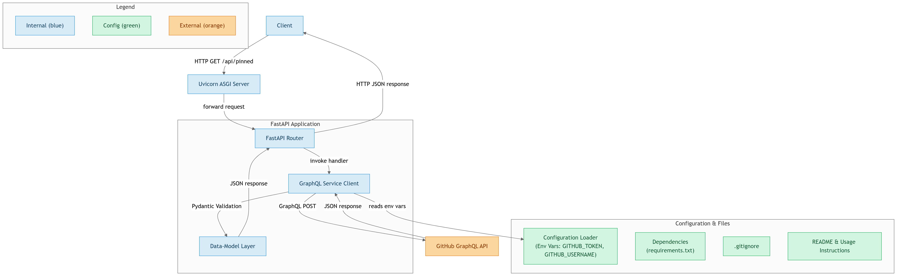

# GitHub Pinned Repositories API

A FastAPI application that creates an API endpoint to fetch pinned repositories from a GitHub profile using GitHub's GraphQL API.

## Features

- Fetches up to 6 pinned repositories
- Returns repository details including:
  - Name
  - Description
  - URL
  - Star count
  - Fork count
  - Primary programming language
- Async implementation for better performance
- Error handling with friendly responses

## Prerequisites

- Python 3.7+
- GitHub Personal Access Token
- Git

## Installation

1. Clone the repository:
```bash
git clone <repository-url>
cd <repository-name>
```

2. Install dependencies using requirements.txt:
```bash
pip install -r requirements.txt
```

3. Create a `.env` file in the root directory:
````plaintext
# filepath: .env
GITHUB_TOKEN=your_github_token
GITHUB_USERNAME=your_github_username
````

## Usage

1. Start the FastAPI server:
```bash
uvicorn main:app --reload
```

2. Access the API endpoint:
```
GET http://localhost:8000/api/pinned
```

### Example Response

```json
[
  {
    "name": "repo-name",
    "description": "Repository description",
    "url": "https://github.com/username/repo-name",
    "stargazerCount": 42,
    "forkCount": 10,
    "languages": {
      "nodes": [
        {
          "name": "Python"
        }
      ]
    }
  }
]
```

## Error Handling

If an error occurs, the API returns:
```json
{
    "error": "Error message"
}
```

## Configuration

- `GITHUB_TOKEN`: Your GitHub Personal Access Token
- `GITHUB_USERNAME`: GitHub username whose pinned repositories you want to fetch

## License

MIT License

## Contributing

1. Fork the repository
2. Create your feature branch
3. Commit your changes
4. Push to the branch
5. Create a new Pull Request


